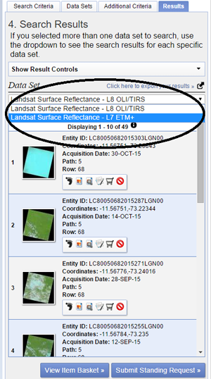

# [Forest change tracking demo](http://changemonitor-wur.github.io/deforestationmonitoring/) 

## Introduction
The `bfastSpatial` package provides utilities to performs change detection analysis (see DeVries et al. 2015; Dutrieux et al. 2015; J. Verbesselt et al. 2010; J. Verbesselt, Zeileis, and Herold 2012) on time-series of spatial gridded data, such as time-series of remote sensing images (Landsat, MODIS and the likes). The tools provided by bfastSpatial allows a user to perform all the steps of the change detection workflow, from pre-processing raw surface reflectance Landsat data, inventorying and preparing them for analysis to the production and formatting of change detection results. The present document is an addition to the [bfast spatial tutorial](http://www.loicdutrieux.com/bfastSpatial/#Downloading_Landsat_data_from_Earth_Explorer_espa) in which the package will be used for deforestation monitoring based on Landsat scenes from Peru. 

In this tutorial the following change detection workflow steps will briefly discussed:

1. Downloading remote sensing scenes
2. Pre-processing the scenes
3. Spatial BFASTMonitor

###Setting up the working environment
Start with setting up your working environment. You want to make sure that we maintain a well-structured project.. In the script below we first load the `libraries` that we will be using. If you cannot load any packages, then you most probably need to install them. Use `install.packages()` to do so. Installation of the bfastspatial package can be done using the `install_github()` method.

```{r, eval=FALSE, results='hide'}
# Loading packages
library(raster)
library(devtools)
library(bfastSpatial)
```
We will set our working directory by specifying a `projectPath` which points to the folder where the project lives. We will create a `path5_row68` folder inside the `data` folder which we will use to save our initial data to. Set your working directory to the projectPath.

```{r, eval=FALSE, results='hide'}
# Set the working directory
projectPath <- "C:/../DeforestationPeru"
inputdata <- "data/path5_row68"
setwd(projectPath)
```

##1. Downloading Landsat data from Earth Explorer/espa
###Retrieving scene ID's
To download data from the [ESPA](https://espa.cr.usgs.gov/login/?next=/) website we first need to create a text file which contains the Landsat scene ID's of our area of interest. The common way to access the Landsat archives and retrieve the list is via the [Earth Explorer platform](http://earthexplorer.usgs.gov). You will need to register for an account.   

After logging in on the Earth Explorer platform you can search the Landsat archive by:

1. Defining the search criteria
2. Choosing data sets
3. Setting additional criteria
4. Exporting results

For this tutorial we will download scenes by specifying path and row numbers under the path/row tab. We want to find all scenes at **path number 5** and **row number 68**. Click the **show** button after entering the desired path and row number.

      

The second step is to select the data sets you wish to order under the Data Sets tab. For this tutorial we will use **Landsat Surface Reflectance - L8 OLI/TIRS** and **Landsat Surface Reflectance - L7 ETM+** from the **Landsat Archive**.


In step three you can select additional criteria depending on your needs. The criterion we are interested in, is the cloud cover. Setting this to **less than 80%** will filter out imagery that are completely covered by clouds and therefore unusable. 

The final step is to export your results. In the results tab you can see a list of the scenes that have been found in the archive according to your search criteria. Click on export results to download the scenes and choose **CSV** as output. Repeat this step also for the Landsat 7 scenes by clicking on the drop down menu under data sets.




You will receive an email with a link where you can download the requested csv. Save the link in your data folder.

###Placing order at ESPA
ESPA requires a list of scene ID's(e.g. LT52302701999134) in a text file as input. We will create this list with an R script that automatically reads the csv files, retrieves the ID's and saves them to a text file. 

First we want to read both csv in R and retrieve the scene ID's. Also, create a file in which the ID's can be stored. Read the scene ID's of the first file and put them in a variable `sceneID` for further processing. 

```{r, eval=FALSE, results='hide'}
# Read both csv files
csv1 <- read.csv(file = "data/Orderlist/path5_row68/LSR_LANDSAT_7ETM_path5_row68.csv")
csv2 <- read.csv(file = "data/Orderlist/path5_row68/LSR_LANDSAT_8_path5_row68.csv")

# Create a text file
order_list <- file("output/orderlist.txt", "w")

# Retrieve scene ID's from first csv file
sceneID <- as.character(csv1$Landsat.Scene.Identifier)
```


To save each scene ID on a separate line in the text file, we will use a loop that retrieves the scene ID's and adds them one by one to the text file with `writeLines()`.


```{r, eval=FALSE, results='hide'}
# Write the ID's in the text file line by line
for(i in 1:length(sceneID)) {
  ID <- sceneID[i]
  print(ID)
  writeLines(ID, order_list, sep="\n")
}
```
The `sep="\n"` argument creates a new line after adding the ID to the text file. 

We also want to add the scene ID's from the second csv file. Put the scene ID's from the second file in the `sceneID` variable and run the for loop again. Add the end close the connection to the file. This will save the ID's to the text file. 

```{r, eval=FALSE, results='hide'}
# Retrieve scene ID's from second csv file
sceneID <- as.character(csv2$Landsat.Scene.Identifier)

# Write the ID's in the text file line by line
for(i in 1:length(sceneID)) { 
  ID <- sceneID[i]
  print(ID)
  writeLines(ID, order_list, sep="\n")
}  

# close connection to file
close(order_list)
```

You can check the end result  of this script by opening your text file.

The final step requires Logging in to the [ESPA platform](https://espa.cr.usgs.gov/login/?next=/). Go to the order data page. Here you can upload the text file with the list of scenes you want to have pre-processed. Select the following options:

* CFMask (Cloud mask)
* Surface reflectance NDMI
* Geotiff 

Now you can submit your order.

### Downloading your data

You will receive an email when your order is ready for download. Use a download manager (e.g. Bulk Download Application or DownloadThemAll plugin for Firefox) to download all .tar.gz files and save them in your data folder. 

##2. Pre-processing the Peru scenes

Let's first create a temporary directory which we will use to save intermediate results of the pre-processing.

```{r}{r, eval=FALSE, results='hide'}
# Create a temporary directory to store the output files.
srdir <- dirout <- file.path(dirname(rasterTmpFile()), 'bfmspatial')
dir.create(dirout, showWarning=FALSE)
```

### Running processLandsatBatch

Now we can use the `processLandsatBatch` method to extract the data and apply the cloud mask which is supplied with the data. We will also provide a new extent to the method to crop all Landsat scenes, since we are only interested in a small part of the entire scene. Specify the extent `c(580485, 617265, -1251615, -1204275))` as a new variable and pass this to the `processLandsatBatch` method.

```{r, eval=FALSE, results='hide'}
# Create an extent variable
newExtent <- extent(c(580485, 617265, -1251615, -1204275))

# List the Landsat scenes
inputList <- list.files(inputdata, full.names=TRUE)

# Process new landsat scenes
processLandsatBatch(x = inputList, outdir = dirout, srdir = srdirNDMI, delete = TRUE, vi = 'ndmi', mask = 'cfmask', keep = 0, e = newExtent, overwrite = TRUE)

# List the processed NDMI scenes for stacking
nmdiList <- list.files(dirout, pattern=glob2rx('ndmi*.grd'), full.names = TRUE)
```

This can take up to several hours depending on the size of the dataset. When the process has finished we can list the processed NDMI scenes for further processing.

### Create a multi-temporal raster object

Finally we need to create a mutli-temporal raster object by adding all processed rasters to a `rasterbrick` using the `timeStack` method. First we will create a new directory where we can save the stack. Then we can load the list with the masked Landsat scenes which we will use as the input for the `timeStack`.

```{r, eval=FALSE, results='hide'}
# Create a new subdirectory in the temporary directory
dirout <- file.path(dirname(rasterTmpFile()), 'stack')
dir.create(dirout, showWarnings=FALSE)

# Generate a file name for the output stack
stackName <- file.path(outputdata, 'stackNDMI_path5_row68.grd')

# Stack the layers
ndmiStack <- timeStack(x=ndmiList, filename=stackName, datatype='INT2S', overwrite=TRUE)
```

##3. Spatial BFASTMonitor

###Working with pixels

Use `bfmPixel` to explore the behavior of the Peru datasets. Make sure you have loaded your rasterstack created in the previous section. Plot one scene from the brick, run the `bfmPixel` method and select a pixel you want to explore by clicking on the plotted Landsat scene. 

```{r, eval=FALSE, results='hide'}
#Plot one scene from the Brick
plot(ndmiStack[[1]])

# run bfmPixel() in interactive mode with a monitoring period 
# starting @ the 1st day in 2015
bfm <- bfmPixel(ndmiBrick, start=c(2015,1), interactive=TRUE)

#Click on a pixel in the plot. 

#Plot the results
plot(bfm$bfm)
```


Run several pixels test as discussed in [Introduction to spatialBfast tutorial](http://www.loicdutrieux.com/bfastSpatial/#Working_with_pixels__bfmPixel) to define the correct parameters.

### Running `bfastMonitor` over entire raster time series

Now that we have done some pixel-based testing, it is time to apply bfastmonitor over an entire raster time series. This will allow us to pinpoint the location and timing of changes in our study area. Pass the arguments for the parameters which you found during pixel-based testing to the `bfmSPatial` and run it. 


```{r, eval=FALSE, results='hide'}
#Define output path
out <- file.path(outputdata, "bfmSpatial.grd")

#Run bfmSpatial
bfmSpatial(infl, start = c(2014, 1), sensor = "ETM+", formula = response~harmon, order = 1, history = c(2005, 1), filename = out) 
```

This may take several hours before the results are done.

### Post-Processing of BFM output

The output of bfmSpatial is a simple rasterBrick. Individual layers can be extracted as with any rasterBrick object. As noted above, the first layer is the breakpoint timing. We will first convert the breakpoint values to change months using the `changeMonth` method.


```{r, eval=FALSE}
#load the bfm
bfm <- brick("output/bfmSpatial/bfmSpatial_path5_row68.grd")

#extract change raster
change <- raster(bfm, 1)

#convert breakpoint values to change months
months <- changeMonth(change)

# set up labels and colourmap for months
monthlabs <- c("jan", "feb", "mar", "apr", "may", "jun", 
               "jul", "aug", "sep", "oct", "nov", "dec")
cols <- rainbow(12)
plot(months, col=cols, breaks=c(1:12), legend=FALSE)

# insert custom legend
legend("bottomright", legend=monthlabs, cex=0.5, fill=cols, ncol=2)

```


The second layer output by bfmSpatial is magnitude. Magnitude is computed as the median residual between expected and observed values throughout the entire monitoring period, meaning that all pixels are assigned a value regardless of whether or not a breakpoint has been detected.

```{r, eval=FALSE}
# extract magn raster
magn <- raster(bfm, 2)

# make a version showing only breakpoing pixels
magn_bkp <- magn
magn_bkp[is.na(change)] <- NA
op <- par(mfrow=c(1, 2))
plot(magn_bkp, main="Magnitude: breakpoints")
plot(magn, main="Magnitude: all pixels")
```


